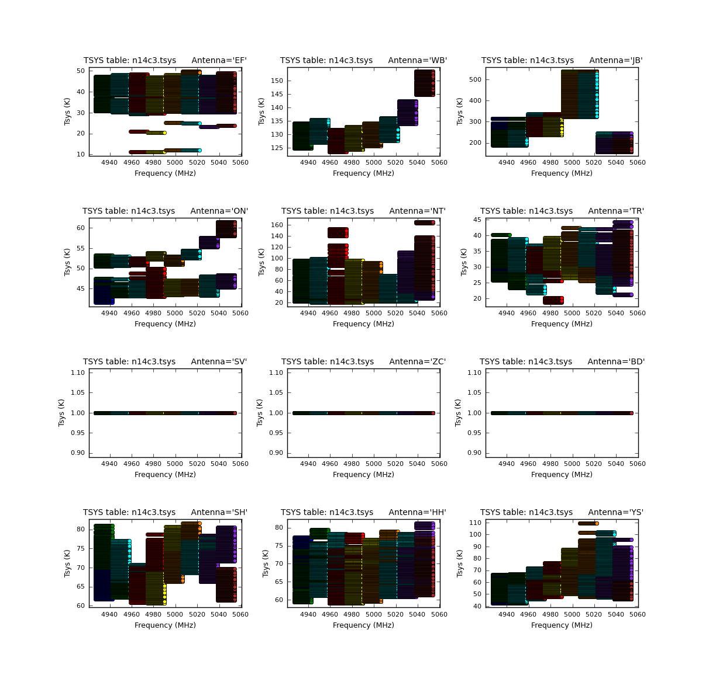
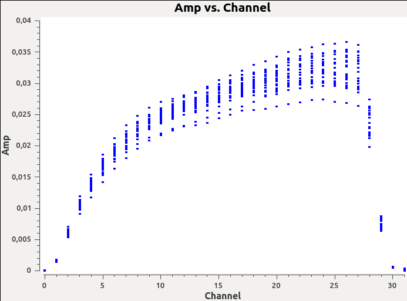
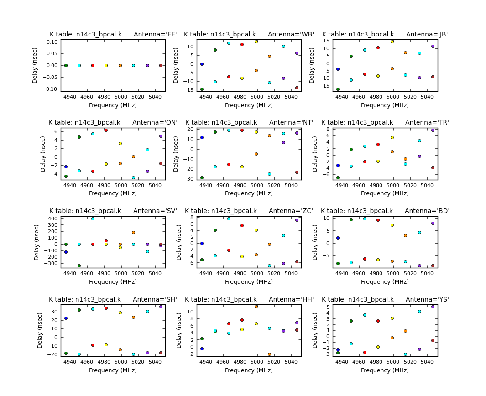
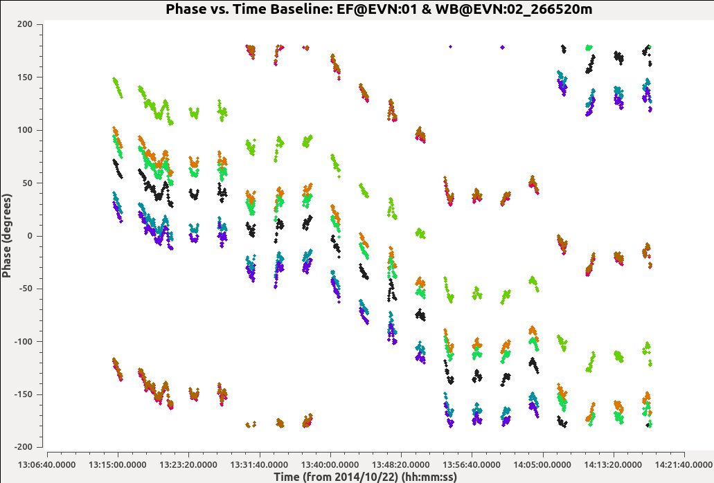
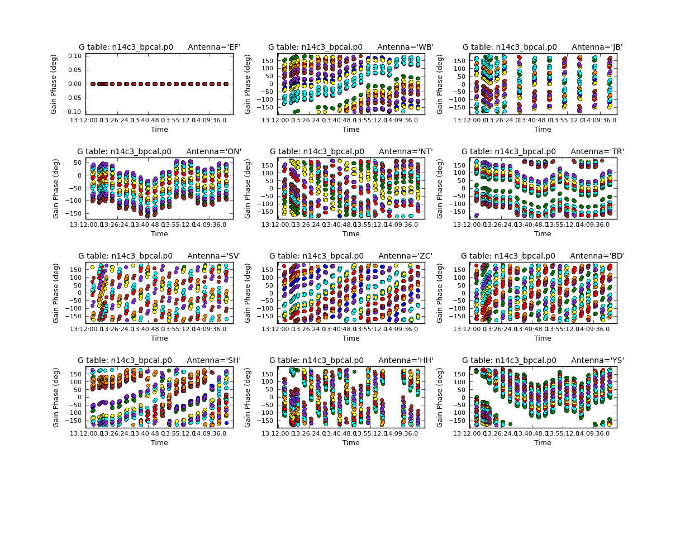

.. _evn_continuum:

EVN continuum tutorial
======================

---------------------------
Objectives of this tutorial
---------------------------
+ Learn how to import data into CASA

**Files needed for this tutorial:** 

-------------------
Setup the workspace
-------------------
First create a directory and copy the above-mentioned files to this new directory. ::

   $ mkdir EVN
   $ cp <some location>/* .
   $ ls
   n14c3_1_1.IDI1  n14c3_1_1.IDI2  n14c3.checksum  NME_DARA.tgz
   $ tar xvf NME_DARA.tgz
   $ ls
   calibration.py                key.py           NME_3C345_skeleton.py
   CASA_1848+283_J1849+3024.pdf  n14c3_1_1.IDI1   NME_all.py
   CASA_Basic_EVN.pdf            n14c3_1_1.IDI2   NME_DARA.tgz
   CASA_J1640+3946_3C345.pdf     n14c3.antab      NME_J1849.py
   flagSH.flagcmd                n14c3.gc         README
   flag_Tar1Ph1.flagcmd          NME_3C345.py.gz  tsys_spectrum.py

**n14c3_1_1.IDI1** and **n14c3_1_1.IDI2** are FITS IDI files from the correlator that contain the raw data. 

---------------------------
Data loading and inspection
---------------------------

Start CASA using the following command ::

   $ casa

If you are using CASA version greater than 5.0, make sure to execute the following command in CASA. ::

   sys.path.append('./')

**Getting help in CASA**: There are different ways in which you can find documentation about CASA tasks.

   + `Online documentation <https://casa.nrao.edu/casadocs>`_
   + The doc() command - Opens help in a web browser
   + The help() command - Displays help inside the CASA session.

**Data conversion**: CASA uses a file format called Measurement Sets (MS). Convert the IDI files to MS using the task *importfitsidi* ::

   default(importfitsidi)
   inp()
   
   fitsidifile = ['n14c3_1_1.IDI1', 'n14c3_1_1.IDI2'] # Specify your input files
   vis='n14c3_prefix.ms'                              # Output MS name
   constobsid=True
   scanreindexgap_s=15                                # Separate scans if gap > 15s
   inp()                                              # Check your input
   
   importfitsidi()                                    # Execute the task
   
In the logger, you might see warnings about antenna diameter and/or negative/zero scan numbers. You can ignore those warnings. ::

   default(importfitsidi)
   inp()                   # What do you see now? Have the parameters changed?
   
   tget(importfitsidi)     # You can also do "run importfitsidi.last" or execfile('importfitsidi.last')
   inp()                   # You'll see that the parameters have now been restored

CASA uses the *importfitsidi.last* to store the parameters of a successfully executed task.

**What is in your MS?** You can inspect the content of an MS using the task *listobs* ::

   default(listobs)
   inp()
   
   vis='n14c3_prefix.ms'
   listobs()

You can find the output of *listobs* in the logger. You can set *listfile='n14c3_prefix.ms.listobs'* to redirect the output of *listobs* to the file *n14c3_prefix.ms.listobs*.

**Visualizing your data**: CASA provides a number of tools to visualize the data present in your MS. For example, you can use the *plotants* task to plot the locations of the antennas. ::

   default(plotants)
   vis='n14c3_prefix.ms'
   plotants()

You will see a plot similar to the one shown below which tells you the relative distances between the stations.

.. image:: _static/plotants_evn.png
   :scale: 75%
   :align: center

Another very useful CASA tool for visualizing the visibility data is the *plotms* task. There are different ways in which you can start up the plotms window. One way to do this is ::

   default(plotms)
   vis='n14c3_prefix.ms'
   xaxis='frequency'
   yaxis='amp'
   field='1848+283'       # specify a bright source
   avgtime='3600'
   antenna='EF&*'         # Plot all baselines containing the antenna EF
   correlation='RR,LL'    # Plot only the parallel hands
   coloraxis='antenna2'
   plotms()

You will see a new window like the one shown in the image below.

.. image:: _static/plotms_evn.png
   :scale: 60%
   :align: center

*plotms* contains a number of knobs that can be tweaked to visualize the visibility data. Try tuning a few knobs and see what you find.

-----------------------------
Correction for Earth rotation
-----------------------------

Adjust the uvw coordinates to allow for the projection effects as the Earth rotates ::

   default('fixvis')
   vis='n14c3_prefix.ms' # Input MS 
   outputvis='n14c3.ms'  # Output MS with correct uvw coordinates
   fixvis()

----------------------------
Insert the antenna diameters
----------------------------

From the output of *listobs* above, we see that the individual station/antennas have 0. diameter. We can insert the diameter and some missing information about feed offsets ::

   ants  = ['EF','WB','JB','ON','NT','TR','SV','ZC','BD','SH','HH','YS','JD']
   diams = [100.0,300.0,75.0,25.0,32.0,32.0,32.0,32.0,32.0,25.0,24.0,40.0,25.0]
   axoffs=[[0.013,4.95,0.,2.15,1.831,0.,-0.007,-0.008,-0.004,-0.002,6.692,2.005,0.],[0.,0.,0.,0.,0.,0.,0.,0.,0.,0.,0.,0.,0.],[0.,0.,0.,0.,0.,0.,0.,0.,0.,0.,0.,0.,0.]]
   
   # We want to modify the antenna table
   tb.open('n14c3.ms/ANTENNA', nomodify=False)
   tb.putcol('DISH_DIAMETER', diams)
   tb.putcol('OFFSET', axoffs)
   tb.close()
   
   # Verify the modifications
   default(listobs)
   vis='n14c3.ms'
   listobs()

-----------------
Insert Tsys table
-----------------

The file n14c3.antab contains Tsys information. However, this file is not compatible with the CASA format. So, we will use the *tsys_spectrum.py* script to convert the n14c3.antab into a CASA table. ::

   inbase='n14c3'
   execfile('tsys_spectrum.py') # execfile is used to run python scripts inside CASA
   
The script *tsys_spectrum.py* writes the content of the antab file into a measurement set named *n14c3.ms*. We can create the Tsys information written to this MS into a calibration table using the *gencal* task. ::

   default(gencal)
   vis='n14c3.ms'
   caltable='n14c3.tsys'
   caltype='tsys'
   gencal()
   
You can plot the values stored in the new table *n14c3.tsys* using the *plotcal* task. ::

   default(plotcal)
   caltable='n14c3.tsys'
   xaxis='freq'
   yaxis='tsys'
   subplot=431
   iteration='antenna'
   plotcal()

You should see an image similar to the one shown below. 
   

   
Notice that three antennas (SV, ZC, and BD) do not have Tsys values. For these three stations, we will only correct for the effect of elevation based on the gains provided in the file *n14c3.gc*. 

---------------------
Flag autocorrelations
---------------------

It is common practice to flag the autocorrelations present in the visibility data. You can do this using the task *flagdata*. ::

   default(flagdata)
   vis='n14c3.ms'
   mode='manual'
   autocorr=T
   flagdata()

CASA will warn about a missing PROCESSOR sub-table. You can safely ignore the warning.

----------------------
Backup the flag table
----------------------

**ToDo: Explain what happens when you flag a visibility.** See if you can find the flag table in casabrowser.

Before we do anything else, now is a good time to make a back up of the flag table. You can do this using the task *flagmanager*. ::

   default(flagmanager)
   vis='n14c3.ms'
   mode='save'
   versionname='preSVandEndChans'   # Use this name to restore your flag table
   flagmanager()

-----------
Preflagging
-----------

In this step, we will remove visibilities that we know are bad. 

**Flag antenna SV**: From the output of plotms above, we see that antenna SV is bad. So, let's flag that antenna using the task *flagdata*. ::

   default(flagdata)
   vis='n14c3.ms'
   mode='manual'
   antenna='SV'
   flagdata()

**Flag bad channels**: You can use *plotms* to identify bad channels in your data. EF&JB form the most sensitive baseline in this dataset (do you know why?). Plot the visibility amplitude as a function of nnel in *plotms*. ::

   default(plotms)
   vis='n14c3.ms'
   xaxis='channel'
   yaxis='amp'
   field='1848+283'
   avgtime='3600'
   antenna='EF&JB'
   correlation='RR&LL'
   spw='0'
   plotms()
   
In the plotms window (and in the image below), you will see that channels 0-5 and channels 29-31 are below half the maximum sensitivity. 

Now that we have identified bad channels for spw 0, can you identify bad channels in the remaining spws? Once you have identified them, you can flag these channels using *flagdata*. ::

   default(flagdata)
   vis='n14c3.ms'
   mode='manual'
   spw = '0:0~5;29~31,2:0~5;29~31,4:0~5;29~31,6:0~5;29~31,1:0~2;27~31,3:0~2;27~31,5:0~2;27~31,7:0~2;27~31'
   flagdata()
   
**Check for bad scans**: Similar to what we did above, we can now plot the visibility as a function of time to identify time slots containing bad visibility data. ::

   default(plotms)
   vis='n14c3.ms'
   xaxis='time'
   yaxis='amp'
   field='1848+283'        
   spw='0~7:13~20'   # Average a few central channels where the response is stable
   avgchannel='8'  
   antenna='EF&*'          
   correlation='RR,LL'     
   coloraxis='baseline'
   plotms()
   
The first one or two integrations of each scan are bad. We can flag this using a specific flagdata mode called 'quack'. ::

   default(flagdata)
   vis='n14c3.ms'
   mode='quack'
   quackinterval=5
   
We also know that antenna HH is bad for scans 62-65. (Can you figure from plotms why antenna HH is bad for these scans?) ::

   default(flagdata)
   vis='n14c3.ms'
   antenna='HH'
   mode='manual'
   scan='62~65'
   flagdata()

In addition to manual flagging, you can also specify flags as a list. For example, the file *flagSH.flagcmd* contains a range of visibilities that have been identified to be bad. Have a look at the file *flagSH.flagcmd*. Once again, you can use the *flagdata* task to flag using a flag list. ::

   default(flagdata)
   vis='n14c3.ms'
   mode='list'      # Notice the mode
   inpfile='flagSH.flagcmd'
   flagdata()
   
Plot the visibility data to ensure that all bad data have been flagged. Now that we have flagged bad data, we can start calibrating our data.

-----------------
Delay calibration
-----------------

During observation, data recorded at each antenna is timestamped so that data from different stations can be synchronized before correlation. However, small clock errors can still be present and they can cause a frequency-dependent phase shift (i.e.) when you plot the visibility phase as a function of frequency, you will see that the phases have a non-zero slope. ::

   default(plotms)
   vis='n14c3.ms'
   xaxis='freq'
   yaxis='phase'
   field='1848+283'
   avgtime='3600s'
   antenna='EF&*'
   coloraxis='corr'
   iteraxis='baseline'
   correlation='RR,LL'
   plotms()
   
.. image:: _static/phaseslope_evn.png
   :scale: 60%
   :align: center

From the image above, we certainly see that there is a systematic slope with some random wiggle. To correct for these small clock errors, we need to determine the gradient of phase against frequency (:math:`d\phi/d\nu`) and correct our complex visibility data. 

If we assume that these clock errors are constant with time, we can use a single scan to derive the corrections. In this case, we will use scan 38 as it contains unflagged data for all spw and antennas. We can derive these corrections using the CASA task *gaincal*. ::

   default(gaincal)
   vis='n14c3.ms'
   caltable='n14c3_bpcal.k' # Name of the output calibration table
   field='1848+283'
   scan='38'
   solint='150s'            # This ensures that only one solution is derived.
   refant='EF'
   gaintype='K'             # This means solve for delay
   parang=T                 # This takes care of feed rotation in Alt-Az mounts
   
You must always look at the derived solutions before doing anything with it. You can plot calibration solutions using the task *plotcal*. ::

   default(plotcal)
   caltable='n14c3_bpcal.k'
   xaxis='freq'
   yaxis='delay'
   iteration='antenna'
   subplot=431
   plotcal()
   

   
Note that for station 'EF', we see that the delay corrections are exactly 0 ns. Can you figure out why this is?

-------------------------------
Time-dependent phase correction
-------------------------------

For an unresolved calibrator at the phase center, the visibility phase vs. time plot should be flat. ::

   default(plotms)
   vis='n14c3.ms'
   xaxis='time'
   yaxis='phase'
   field='1848+283'
   spw='0~7:13~20'
   avgchannel='8'
   antenna='EF&*'
   coloraxis='spw'
   iteraxis='baseline'
   correlation='RR'
   plotms()
   
However, the visibility phases in the image shown below are clearly not flat.
   

   
We will once again use the task *gaincal* to derive a correction for this. However, instead of setting gaintype='K' in the previous step, we will use gaintype='G' and calmode='p'. These two parameters tell *gaincal* to derive time-dependent phase correction. ::

   default(gaincal)
   vis='n14c3.ms'
   caltable='n14c3_bpcal.p0'
   field='1848+283'
   solint='30s'              
   refant='EF'
   gaintype='G'
   calmode='p'
   gaintable=['n14c3_bpcal.k']
   interp='nearest'
   parang=T
   gaincal()
   
In the gaincal task above, note that we set **gaintable=['n14c3_bpcal.k']**. This tells gaincal to apply the delay correction derived above before deriving the new phase solutions. Plot the derived phase solutions. ::

   default(plotcal)
   caltable='n14c3_bpcal.p0'
   xaxis='time'
   yaxis='phase'
   iteration='antenna'
   subplot=431
   plotcal()
   

   
--------------------
Bandpass calibration
--------------------

**Need to motivate why we do bandpass calibration**

To determine the bandpass corrections, we use the task *bandpass*. ::

   default(bandpass)
   vis='n14c3.ms'
   caltable='n14c3.B'
   field='1848+283'
   solint='inf'
   combine='scan'
   refant='EF'
   solnorm=T
   gaintable=['n14c3_bpcal.k','n14c3_bpcal.p0','n14c3.tsys','n14c3.gc']
   interp='nearest'
   parang=T
   bandpass()
   
By setting **solint='inf'** and **combine='scan'**, we are instructing *bandpass* to combine all scans and derive time-independent amplitude and phase corrections for each channel. Visualize the solutions using *plotcal*. ::

   default(plotcal)
   caltable='n14c3.B'
   xaxis='freq'
   yaxis='amp'          # You can also set this to 'phase'
   iteration='antenna'
   subplot=431
   plotcal()

-----------------------------------------
Apply calibration solutions to the target
-----------------------------------------

Now that we have determined the calibration solutions to account for various instrumental effects (using a calibrator source), we can now apply these corrections to the target data. We can do this using the task *applycal*. ::

  default(applycal)
  vis='n14c3.ms'
  field=''          # Apply the solutions to all source
  gaintable=['n14c3.tsys','n14c3.gc','n14c3_bpcal.k','n14c3.B']
  interp='nearest'
  parang=T
  applymode='calonly'
  applycal()
  
Notice that we are not applying the time-dependent phase corrections (n14c3_bpcal.p0) to the target. Can you guess why this is?

If you look at the logger carefully, you will see that applycal reports that it is "Adding CORRECTED_DATA column(s)". This means that the applycal task has created a copy of our DATA into a new column called CORRECTED_DATA inside our measurement set and has applied the calibration solutions to this new column. This duplication of data ensures that the original data is left untouched.

Now, using the CORRECTED_DATA column, make the following plots for the source 1848+283:

+ Amplitude vs. Frequency
+ Phase vs. Frequency
+ Phase vs. Time

What do you see in these plots? How do they compare to the previous plots we saw above?

---------------------------------------------------
Split out the target along with its phase-reference
---------------------------------------------------

For convenience, let us now create two new measurement sets for each of our target along with its phase-reference source. We need to make sure that the new MS are created using the calibrated visibilities present in the CORRECTED_DATA column. 

First, split out the source J1640+3946 along with its phase-reference calibrator 3C345 ::

   default(split)
   vis='n14c3.ms'
   outputvis='J1640+3946_3C345.ms'
   field='J1640+3946,3C345'
   datacolumn='corrected'
   split()
   
Next, split out the target J1849+3024 along with its phase-reference calibrator 1848+283. ::

   outputvis='1848+283_J1849+3024.ms'
   field='1848+283,J1849+3024'
   datacolumn='corrected'
   split()
   
This concludes the first part of the EVN Basic Continuum tutorial.
