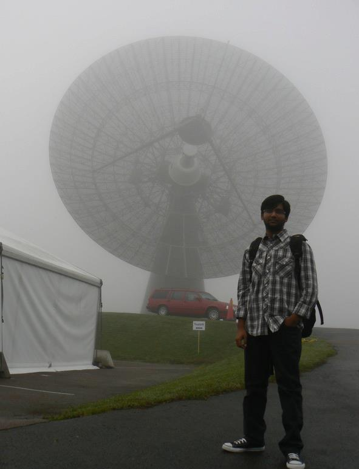

.. Sarrvesh's website documentation master file, created by
   sphinx-quickstart on Tue May 15 16:21:39 2018.
   You can adapt this file completely to your liking, but it should at least
   contain the root `toctree` directive.

Welcome to Sarrvesh's website
=============================

I am a telescope scientist working with the LOw Frequency ARray (LOFAR) at ASTRON. For my PhD, I studied the non-thermal emission and magnetic fields in nearby galaxies using the LOFAR and the Westerbork radio telescopes. You can find the electronic copy of my thesis :download:`here <_static/sarrvesh_thesis.pdf>`.

You can download my CV :download:`here <_static/CV_Sarrvesh.pdf>`. You can access my list of publication on `NASA ADS <http://adsabs.harvard.edu/cgi-bin/nph-abs_connect?library&libname=sarrvesh&libid=503b7579ff>`_ or here. 

View my profile on `ORCID <http://orcid.org/0000-0002-7587-4779>`_.

You can contact me through one of the following means:

| ASTRON (office 1.34),
| Oude Hoogeveensedijk 4,
| 7991 PD Dwingeloo,
| the Netherlands.

| Phone: +31 (0) 521 595 753
| Email: `sarrvesh@astron.nl <mailto:sarrvesh@astron.nl>`_.

.. toctree::
   :maxdepth: 1
   :hidden:

   research
   publications
   software
   dara2018
   assorted

